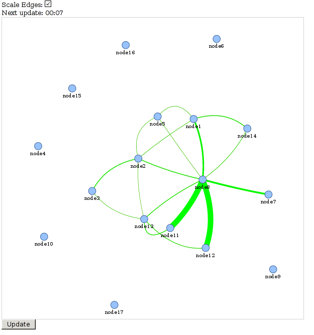

# tinc-vis
 Small framework to visualize tinc network based on [vis.js](http://visjs.org/).

## Requirements
   - tinc version >= 1.1
   - bin/gen-data.py depends on [tinc-info](https://github.com/exioReed/tinc-info)
   - local http server (nginx, thttpd, apache ...)

## Usage
   - bin/gen-data.py -n netname -o www/data/nodes.json

## Screenshot

